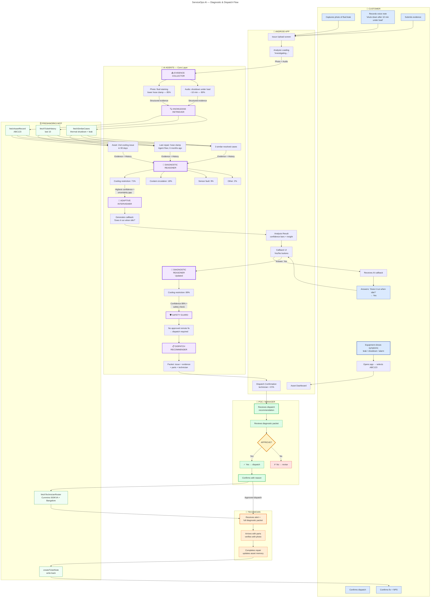

# ServiceOps AI — Diagnostic & Dispatch Flow

```mermaid
---
title: ServiceOps AI — Diagnostic & Dispatch Flow
---
flowchart TD
    subgraph CUST ["👤 CUSTOMER"]
        C1[Equipment shows symptoms<br/>leak / shutdown / alarm]
        C2[Opens app → selects ABC123]
        C3[Captures photo of fluid leak]
        C4[Records voice note<br/>'shuts down after 10 min under load']
        C5[Submits evidence]
        C6[Receives AI callback]
        C7[Answers: 'Does it run when idle?'<br/>→ Yes]
        C8[Confirms dispatch]
        C9[Confirms fix + NPS]
    end

    subgraph APP ["📱 ANDROID APP"]
        A1[Asset Dashboard]
        A2[Issue Upload screen]
        A3[Analysis Loading<br/>'Investigating...']
        A4[Analysis Result<br/>confidence bars + insight]
        A5[Callback UI<br/>Yes/No buttons]
        A6[Dispatch Confirmation<br/>technician + ETA]
    end

    subgraph AI ["🤖 AI AGENTS — Core Layer"]
        E1["📥 EVIDENCE COLLECTOR"]
        E1A[Photo: fluid staining<br/>lower hose clamp — 85%]
        E1B[Audio: shutdown under load<br/>~10 min — 90%]
        
        K1["🔍 KNOWLEDGE RETRIEVER"]
        K1A[Asset: 2nd cooling issue<br/>in 90 days]
        K1B[Last repair: hose clamp<br/>Agent Ravi, 6 months ago]
        K1C[3 similar resolved cases]
        
        D1["🧠 DIAGNOSTIC REASONER"]
        D1A["Cooling restriction: 71%"]
        D1B["Coolant circulation: 18%"]
        D1C["Sensor fault: 9%"]
        D1D["Other: 2%"]
        
        I1["💬 ADAPTIVE INTERVIEWER"]
        I1A["Generates callback:<br/>'Does it run when idle?'"]
        
        D2["🧠 DIAGNOSTIC REASONER<br/>Updated"]
        D2A["Cooling restriction: 89%"]
        
        S1["🛡️ SAFETY GUARD"]
        S1A["No approved remote fix<br/>→ dispatch required"]
        
        R1["📋 DISPATCH RECOMMENDER"]
        R1A[Packet: issue + evidence<br/>+ parts + technician]
    end

    subgraph FW ["🗄️ FRESHWORKS MCP"]
        F1[fetchAssetRecord<br/>ABC123]
        F2[fetchTicketHistory<br/>last 10]
        F3[fetchSimilarCases<br/>thermal shutdown + leak]
        F4[fetchTechnicianRoster<br/>Cummins 500KVA + Bangalore]
        F5[createTicketNote<br/>write-back]
    end

    subgraph HITL ["👔 POC / MANAGER"]
        H1[Receives dispatch<br/>recommendation]
        H2[Reviews diagnostic packet]
        H3{"APPROVE?"}
        HY[✓ Yes → dispatch]
        HN[✗ No → revise]
        H4[Confirms with reason]
    end

    subgraph TECH ["🔧 TECHNICIAN"]
        T1[Receives alert +<br/>full diagnostic packet]
        T2[Arrives with parts<br/>verifies with photo]
        T3[Completes repair<br/>updates asset memory]
    end

    C1 --> C2 --> A1
    C3 --> A2
    C4 --> A2
    C5 --> A2
    A2 --> A3
    A3 -->|"Photo + Audio"| E1
    E1 --> E1A & E1B
    E1A & E1B -->|"Structured evidence"| K1
    K1 --> F1 & F2 & F3
    F1 & F2 & F3 --> K1A & K1B & K1C
    K1A & K1B & K1C -->|"Evidence + History"| D1
    D1 --> D1A & D1B & D1C & D1D
    D1A -->|"Highest confidence +<br/>uncertainty gap"| I1
    I1 --> I1A
    I1A --> A4
    A4 --> A5
    A5 --> C6
    C6 --> C7
    C7 --> A5
    A5 -->|"Answer: Yes"| D2
    D2 --> D2A
    D2A -->|"Confidence 89% +<br/>safety check"| S1
    S1 --> S1A
    S1A --> R1
    R1 --> R1A
    R1A --> A6
    A6 --> H1
    H1 --> H2 --> H3
    H3 -->|"Yes"| HY --> H4
    H3 -->|"No"| HN
    H4 --> F4
    F4 --> T1
    H4 -->|"Approved dispatch"| T1
    T1 --> T2 --> T3
    T3 --> F5
    F5 --> C9

    style C1 fill:#dbeafe,stroke:#1e40af,stroke-width:2px
    style C3 fill:#dbeafe,stroke:#1e40af
    style C4 fill:#dbeafe,stroke:#1e40af
    style C5 fill:#dbeafe,stroke:#1e40af
    style C7 fill:#dbeafe,stroke:#1e40af
    style C8 fill:#dbeafe,stroke:#1e40af
    style C9 fill:#dbeafe,stroke:#1e40af
    
    style E1 fill:#f3e8ff,stroke:#7c3aed,stroke-width:3px
    style K1 fill:#f3e8ff,stroke:#7c3aed,stroke-width:2px
    style D1 fill:#f3e8ff,stroke:#7c3aed,stroke-width:3px
    style I1 fill:#f3e8ff,stroke:#7c3aed,stroke-width:2px
    style D2 fill:#f3e8ff,stroke:#7c3aed,stroke-width:3px
    style S1 fill:#f3e8ff,stroke:#7c3aed,stroke-width:2px
    style R1 fill:#f3e8ff,stroke:#7c3aed,stroke-width:2px
    
    style H1 fill:#dcfce7,stroke:#16a34a,stroke-width:2px
    style H2 fill:#dcfce7,stroke:#16a34a
    style H3 fill:#fef3c7,stroke:#d97706,stroke-width:3px
    style HY fill:#dcfce7,stroke:#16a34a
    style HN fill:#fee2e2,stroke:#dc2626
    style H4 fill:#dcfce7,stroke:#16a34a,stroke-width:2px
    
    style T1 fill:#ffedd5,stroke:#ea580c,stroke-width:2px
    style T2 fill:#ffedd5,stroke:#ea580c
    style T3 fill:#ffedd5,stroke:#ea580c
    
    style F1 fill:#f0fdf4,stroke:#15803d
    style F2 fill:#f0fdf4,stroke:#15803d
    style F3 fill:#f0fdf4,stroke:#15803d
    style F4 fill:#f0fdf4,stroke:#15803d
    style F5 fill:#f0fdf4,stroke:#15803d
```
