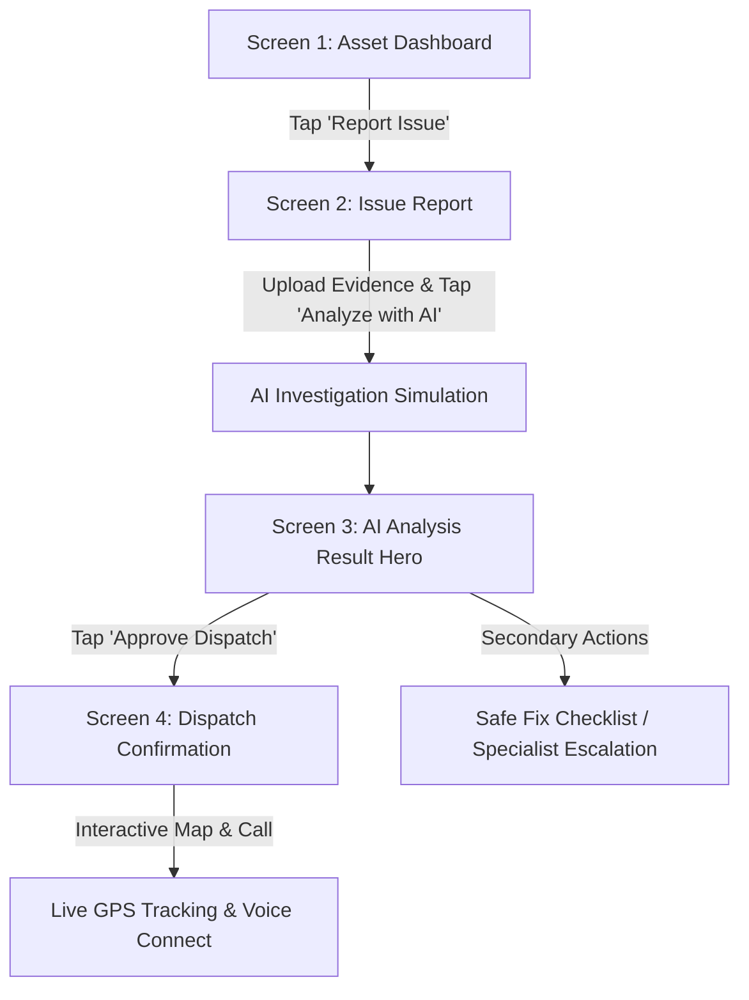

# Implementation Plan - ServiceOps AI Mobile Prototype

Build an interactive, hackathon-ready mobile Android prototype for **ServiceOps AI**, an industrial field service AI assistant designed for factory operators to report equipment issues and trigger AI-diagnosed technician dispatch.

## Proposed Architecture & Delivery

We will build a high-fidelity, self-contained single-page React application with rich Vanilla CSS/Tailwind styling and SVG/Canvas graphics that can be run directly in any browser and previewed seamlessly on mobile devices (360px–420px responsive container or desktop Android device mockup mode).

### Key Features & Screen Implementations

---

## User Review Required

> [!IMPORTANT]
> - **Self-Contained Deployment**: The prototype is built as a zero-setup, stand-alone web application (`index.html` + modular React components and CSS) that can be opened directly or served via any standard dev server.
> - **Hackathon Demo Enhancements**: We will include a floating Quick-Nav toolbar to allow instant switching between all 4 screens and a "Reset Flow" button for frictionless demo repetition during presentations.

---

## Proposed Changes

### Core Prototype Application

#### [NEW] [index.html](file:///home/zenteiq/Documents/sridhar/personal/serviec/index.html)
- Standalone HTML5 shell loaded with React 18, Babel standalone, Tailwind CSS, Lucide icons, and Google Fonts (`Inter`, `Space Grotesk`, `Roboto`).
- Android mobile mockup viewport with toggleable frame (Device frame vs Fullscreen mobile).

#### [NEW] [app.js](file:///home/zenteiq/Documents/sridhar/personal/serviec/app.js)
Contains the state management and 4 rich screens:
1. **Screen 1: Asset Dashboard**
   - Header with ServiceOps AI badge, notification counter, and operator profile.
   - Cummins 500KVA Generator card with live status, serial `SN-78234-B`, installation date, and maintenance vitals.
   - Primary "Report Issue" action button with pulsing indicator.
   - Recent activity list with status tags and event history.
   - Android bottom navigation bar (Home, Assets, History, Profile).

2. **Screen 2: Issue Report**
   - Step indicator: `1. Upload Evidence → 2. AI Analysis → 3. Resolution`.
   - Asset info summary banner (`ABC123 · Cummins 500KVA · Peenya, Bangalore`).
   - Interactive Photo Evidence uploader with preview of fluid leak at hose clamp, heatmap toggle, and retake/zoom controls.
   - Interactive Voice Note Recorder with live audio visualizer waveform, audio playback, timer `0:08 / 0:15`, and transcript.
   - OCR Fault Code scanner simulation (`ERR-704: Coolant Temp Exceeded`).
   - Submit action triggering multi-step AI Investigation loading modal.

3. **Screen 3: AI Analysis Result (Hero Screen)**
   - Top banner with verified timestamp and diagnosis status.
   - Horizontal Evidence Summary cards (Visual, Voice, Asset History).
   - Dynamic animated confidence breakdown bars:
     - *Cooling restriction (recurring)*: 71%
     - *Coolant circulation issue*: 18%
     - *Temperature sensor fault*: 9%
     - *Other*: 2%
   - Highlighted Key Insight alert: *Last repair — hose clamp replacement by Agent Ravi, 6 months ago*.
   - AI Callback simulation card with call acceptance modal.
   - Action buttons: *Approve Dispatch*, *Try Safe Fix First*, *Escalate to Specialist*.

4. **Screen 4: Dispatch Confirmation**
   - Animated checkmark & Technician Assigned celebration header.
   - Technician profile card for *Ravi Kumar* (Rating 4.8/5, 147 jobs, 12 min ETA, past repair history on this generator).
   - Diagnostic packet: Requisitioned parts list (*Hose clamp kit, Coolant 5L - In Van*), attached evidence thumbnails.
   - Animated SVG Live GPS Route Map showing Ravi's van route to Peenya Industrial Area with live pulse and traffic stats.
   - Live Action buttons: *Track Arrival* and *Contact Technician*.

5. **Demo Modals & Overlays**
   - Simulated AI Phone Call overlay.
   - DIY Safe Fix guided checklist.
   - OCR camera scanning simulation.
   - Full live tracking sheet.

#### [NEW] [styles.css](file:///home/zenteiq/Documents/sridhar/personal/serviec/styles.css)
- Industrial color palette tokens: Primary Navy `#1a237e`, Slate `#0f172a`, Emerald `#10b981`, Amber `#f59e0b`, Red `#ef4444`.
- Smooth animations: waveform pulsing, radar scan, progress bar filling, card transitions.
- Android status bar and bottom gesture bar styling.

---

## Verification Plan

### Automated / Syntax Check
- Verify JavaScript syntax and JSON mock data validity.

### Manual Verification
- Test all navigation flows:
  - Asset Dashboard → Issue Report → AI Analysis → Dispatch Confirmation.
  - Interactive audio playback, photo switching, and confidence bar animations.
  - Modal interactions: AI Callback, Safe Fix checklist, OCR scanner.
  - Quick-switch navigation bar for rapid pitch demonstration.
